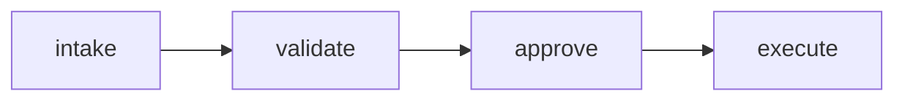

# Week 1 — Friction inventory

> Copy content from the [Week 1 workbook](https://meerzah.github.io/ai-systems-portfolio/tracker/workbooks/week-01.html) when complete, or fill in directly here and commit.

## Top 3 frictions

| Rank | Category | Volume (30d) | Avg minutes | Notes |
|------|----------|--------------|-------------|-------|
| 1 | | | | |
| 2 | | | | |
| 3 | | | | |

## Chosen automation candidate

**Pick (one):** access request OR ticket triage

**Why this one:**

## Workflow link

See `week-02-workflow.md` (Tue diagram) or paste Mermaid below:

## Portfolio narrative (1 paragraph)

Why this candidate fits your AI Systems story:
