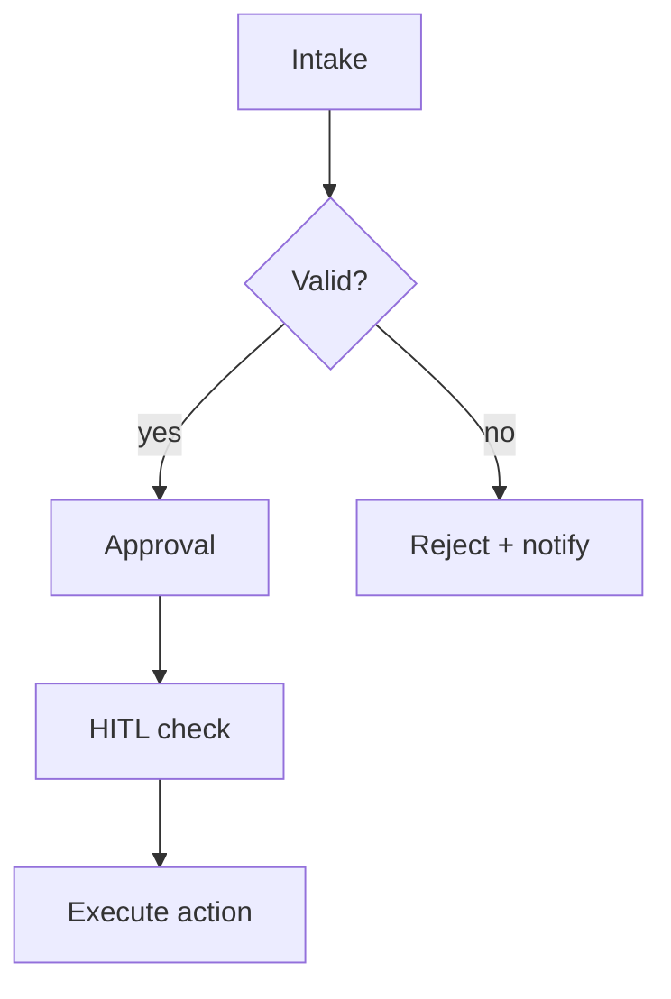

# Week 2 — Workflow diagram

## Current manual path

- **Trigger:**
- **Submitter:**
- **Approver(s):**
- **Executor:**

## HITL gate

What must be human-approved before any Okta write or ticket state change:

## Reuse from shipped patterns

What you can reuse from Slack intake / workflow automation:

## Diagram

## Gap analysis

What's missing vs your chosen candidate from Week 1:
